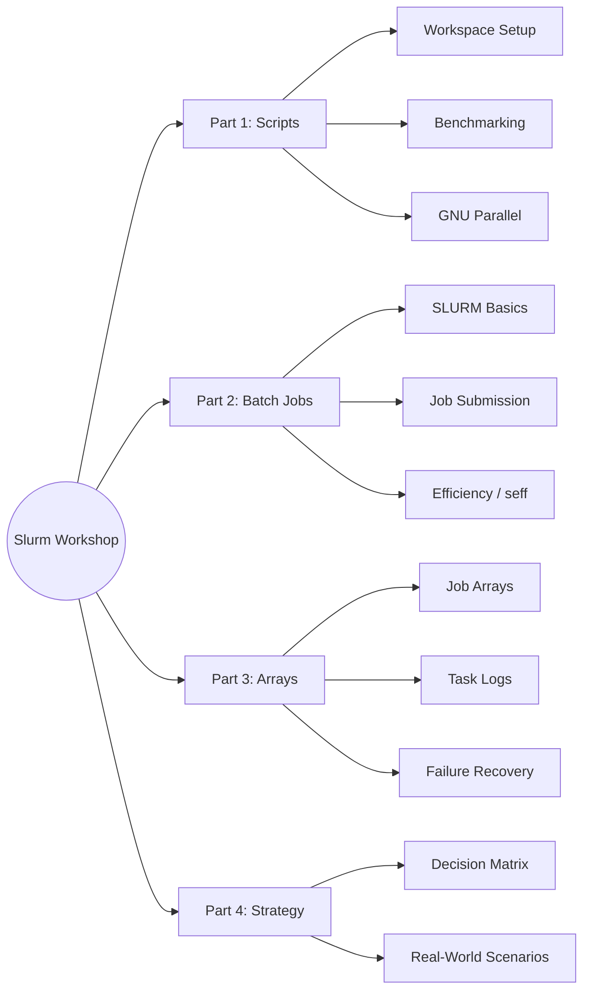

# Slurm Efficiency & Parallelism Workshop (2026)

Welcome to the 2026 Slurm Workshop! This 4-hour session is designed to help you move beyond basic job submission and master efficient, scalable computing on the University Cluster.

## Instructors
- Viswanathan Satheesh
- Rick Masonbrink
- Sharu Paul Sharma

## Email: 
If you have any questions/suggestions: gifhelp@iastate.edu

## Workshop Goals
- Understand how to measure and optimize job efficiency (`seff`).
- Learn when to use **GNU Parallel** vs. **Slurm Job Arrays**.
- Master the syntax for running thousands of jobs without crashing the scheduler.

## Workshop Map

## Curriculum

The workshop material is split into two halves, optimized for a 4-hour session:

### [Part 1 & 2: Scripts and Batch Jobs](./comprehensive_part1.md)
* **Part 1: Building and Benchmarking Scripts** - Setting up the workspace, analyzing running times, and migrating from sequential loops to GNU Parallel.
* **Part 2: Introduction to SLURM & Batch Jobs** - Core concepts, submitting `sbatch` scripts, assessing resource efficiency with `seff`, and tracking down errors in failed jobs.

### [Part 3 & 4: Arrays and Strategy](./comprehensive_part2.md)
* **Part 3: Scaling with SLURM Arrays** - Replacing manual loops with Job Arrays, mapping inputs to array indices, recording separate logs, and isolating failed tasks.
* **Part 4: Strategy, Flowcharts & Wrap-up** - Using the decision matrix to pick the right strategy for your pipeline—whether that's GNU Parallel, SLURM arrays, or task grouping.

## Getting Started
1. Connect to the cluster via **VSCode OnDemand**.
2. Follow the setup and preamble instructions at the very beginning of [Part 1 & 2](./comprehensive_part1.md) to initialize your workspace and start the workshop!
